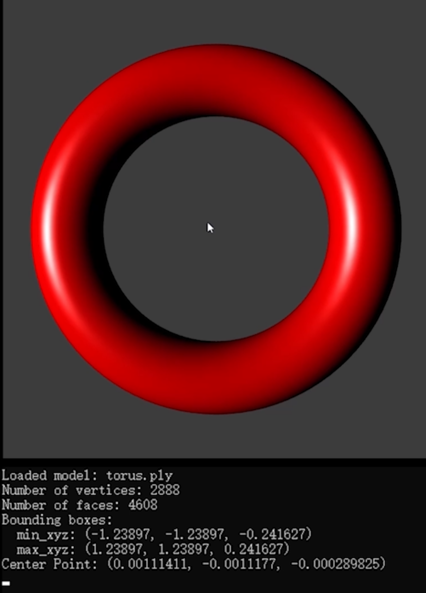
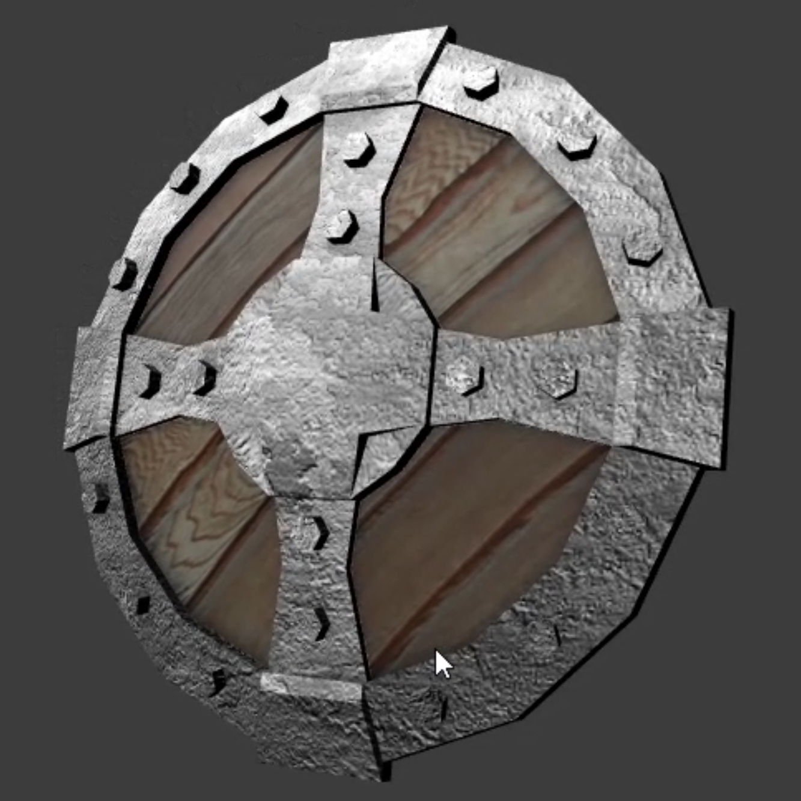
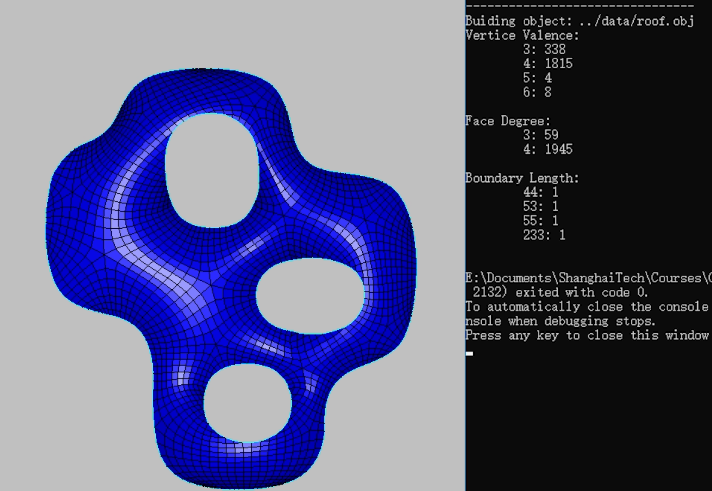
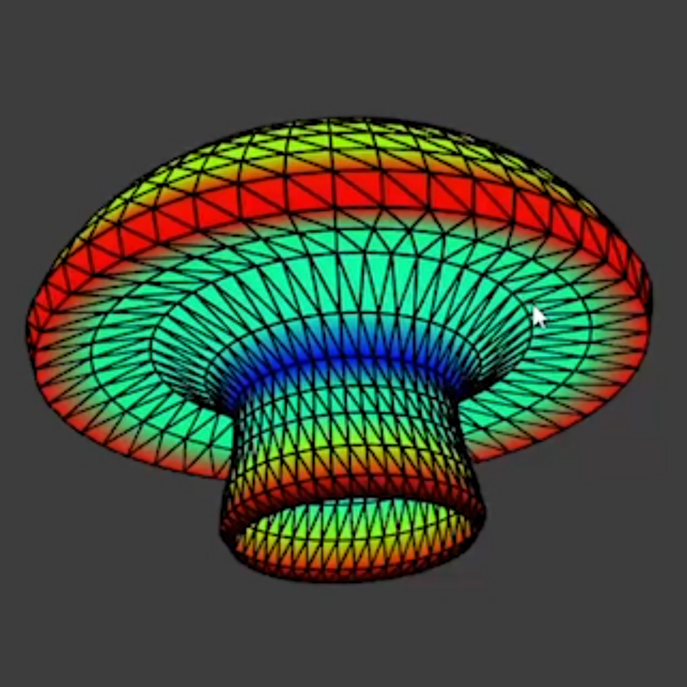

# Projects for Computer Graphics II

Lecturer: [Chi-Han Peng](https://pengchihan.co/)

This repo includes source code of cource projects for Computer Graphics II (2020 Spring, ShanghaiTech University). The code are written in C++ and relies on [*openFrameworks*](https://openframeworks.cc/).

Five individual projects are included:

1. A mesh viewer, which supports draging, rotation, and scaling, with the Blinn-Phong reflection model.
   
 </img>

2. A demo of normal mapping, adding visual details to a meshing with a normal map.
   
 </img>

3. A demo of environment mapping, illustrating the effects of reflection and fefraction inside a skybox.
   
 </img>

4. A parser for half-edge, which is a data structure to ease manipulation.
   
 </img>

5. Visualization of curvatures given an object.
   
 </img>

